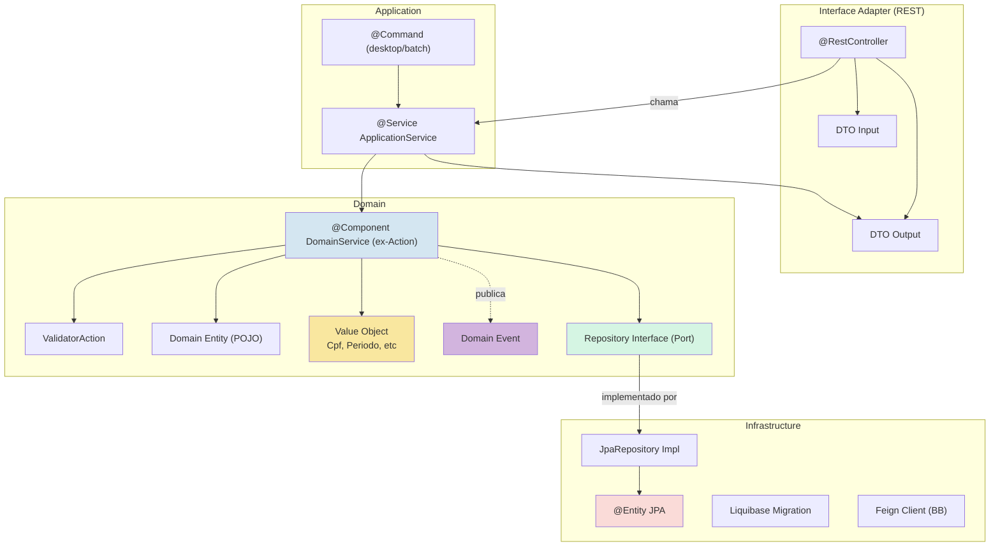
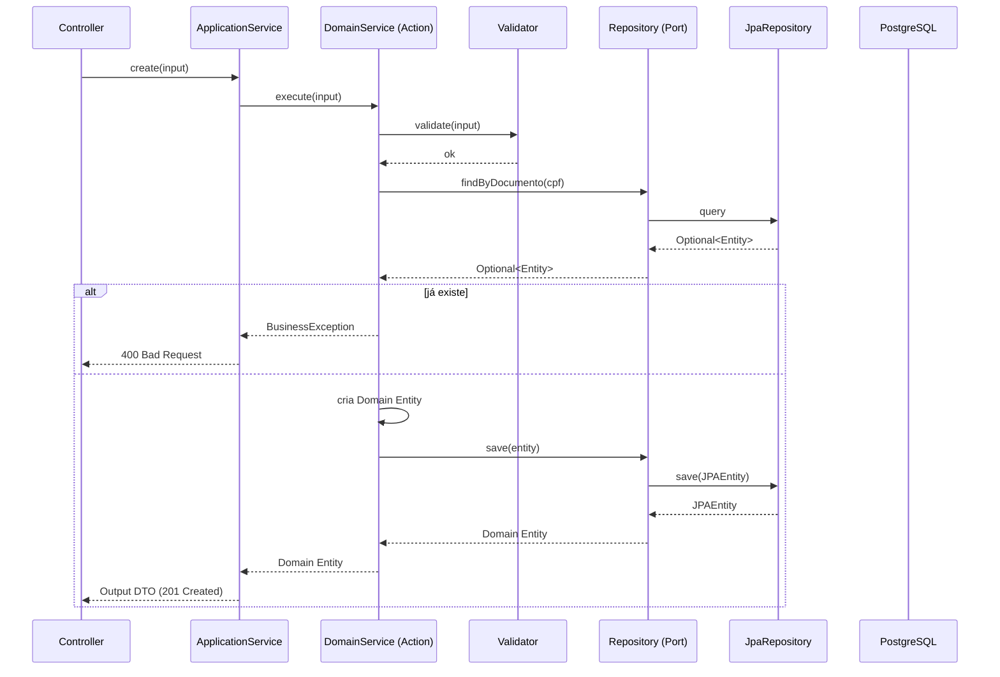
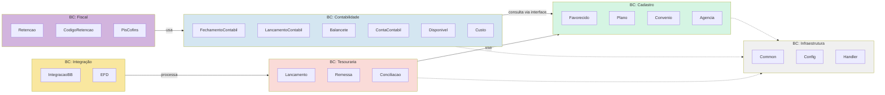

# Proposta de Arquitetura: DDD Evolutivo
## dataa-tesouraria — Análise de Débito Técnico e Roadmap

---

## 1. Diagnóstico Atual

### Números do Projeto

| Métrica | Valor |
|---------|-------|
| Total de classes Java | **2.767** |
| Domínios (pacotes top-level) | **~30** |
| Controllers | **65+** |
| Actions | **80+** |
| Commands | **30+** |
| Total de testes unitários | **36 classes** |
| Domínios SEM teste | **13+** |
| JaCoCo LINE threshold | **0,05%** |

### Inconsistências de Injeção

| Padrão | Arquivos | % do código |
|--------|----------|-------------|
| `@Resource` (legado) | **771** | ~71% das injeções |
| `@RequiredArgsConstructor` (moderno) | **325** | ~29% |
| `@Autowired` (terceiro padrão) | **202** | conflitante |
| Classes com padrão MISTO | **11** | Resource + RequiredArgs |

### Inconsistências de Nomenclatura

| Estrutura | Quantidade |
|-----------|-----------|
| Pacotes `action/` (singular) | **35** |
| Pacotes `actions/` (plural) | **20** |
| Pacotes `service/action/` (redundante) | **15** |

### Acoplamento Entre Domínios

| Dependência | Classes afetadas |
|-------------|-----------------|
| contabilidade → favorecido (direto) | **46** |
| favorecido → contabilidade (bidirecional) | **9** |
| favorecido → lancamento | **7** |
| plano → favorecido | **26** |

---

## 2. Riscos Concretos

### Risco #1 — Injeção híbrida
Três padrões de injeção (`@Resource` por nome, `@Autowired` por tipo, `@RequiredArgsConstructor` por construtor) = três comportamentos diferentes. 11 classes misturam `@Resource` + `@RequiredArgsConstructor` na mesma classe. Cenário propício para `UnsatisfiedDependencyException` em produção.

### Risco #2 — Efeito cascata sem barreira
Contabilidade importa entidades de `favorecido` diretamente (46 classes). Uma mudança em `favorecido.domain` quebra contabilidade **sem warning do compilador**. Só descobre no build ou em produção.

### Risco #3 — Onboarding caótico
Um novo dev abre o projeto e encontra:
- `agencia/action/` (flat)
- `favorecido/action/contato/` (sub-actions hierárquicas)
- `contabilidade/*/service/action/` (caminho triplicado)
- `lancamento/actions/` (plural)

Não há um padrão único para seguir. Cada PR precisa de code review para acertar estrutura.

### Risco #4 — Sem rede de proteção
Zero ArchUnit + 36 testes para 2.767 classes (~1,3%) + JaCoCo LINE em 0,05% = qualquer refatoração é no escuro. Ninguém sabe se quebrou algo até subir em produção.

### Risco #5 — Dívida acelera
Cada sprint adiciona ~5-10 novas classes no padrão que o dev escolheu. O débito cresce mais rápido que a capacidade de pagar.

---

## 3. Mapa de Dependências Atual (Mermaid)

```mermaid
graph TB
    subgraph "BC: Cadastro"
        Favorecido["favorecido<br/>332 classes"]
        Plano["plano<br/>42 classes"]
        Agencia["agencia<br/>18 classes"]
    end

    subgraph "BC: Contabilidade"
        Contabilidade["contabilidade<br/>789 classes<br/>20 sub-domínios"]
    end

    subgraph "BC: Tesouraria"
        Lancamento["lancamento<br/>307 classes"]
        Remessa["remessa<br/>28 classes"]
        Conciliacao["conciliacao<br/>149 classes"]
    end

    subgraph "BC: Integração"
        IntegracaoBB["integracao/bb<br/>97 classes"]
        EFD["efd<br/>47 classes"]
    end

    subgraph "Outros"
        Outros["15+ domínios menores<br/>custeio, centroCusto,<br/>retencao, etc."]
    end

    Contabilidade -->|46 imports diretos| Favorecido
    Plano -->|26 imports| Favorecido
    Favorecido -->|9 imports| Contabilidade
    Favorecido -->|7 imports| Lancamento
    Lancamento --> Conciliacao
    IntegracaoBB --> Lancamento
    Outros -->|vários| Favorecido

    style Contabilidade fill:#fadbd8
    style Favorecido fill:#d5f5e3
```

---

## 4. Arquitetura Proposta: DDD Evolutivo

### Como é hoje vs Como fica

```
HOJE:                              PROPOSTA:

Controller                          Controller (REST)
  │                                   │
Service (fino)                      ApplicationService (@Transactional, fino)
  │                                   │
Action (lógica)                     DomainService / UseCase (lógica de negócio)
  │                                   │
@Entity (JPA + regras de negócio)   Domain Entity (POJO — sem JPA)
  │                                   │
Repository (JPA)                    Repository Interface (Port no domínio)
                                       │
                                    JpaRepository (implementação na infra)
```

### Diagrama da Arquitetura Alvo



### Fluxo de uma requisição (ex: criar Favorecido)



---

## 5. Bounded Contexts Propostos



---

## 6. Custo/Benefício

### Estimativa de Esforço

| Fase | Sprints | Horas | Quem Envolve |
|------|---------|-------|-------------|
| **Fase 1: Fundação** | 2 | ~120h | 1 dev sênior |
| **Fase 2: Consolidação** | 2 | ~160h | 2 devs (pleno + sênior) |
| **Fase 3: Evolução** | 2 | ~120h | 2 devs |
| **Total** | **6 sprints** | **~400h** | Time atual |

### Retorno sobre Investimento

| Benefício | Quando sente | Economia estimada (anual) |
|-----------|-------------|--------------------------|
| Bug prevention (ArchUnit detecta violações no `mvn compile`) | Imediato (Sprint 1) | ~80h em debug de regressão |
| Onboarding mais rápido (padrão único documentado) | Sprint 2+ | ~120h por novo dev contratado |
| Code review mais rápido (menos PR rejeitado por estrutura) | Sprint 2+ | ~60h em retrabalho |
| Refatoração sem medo (ArchUnit + testes = segurança) | Sprint 3+ | ~100h em "achei que não quebrava" |
| Split para microserviço viável (Bounded Contexts prontos) | Sprint 6+ | Milhares de horas (quando/quiser separar) |
| **ROI estimado** | **6-8 meses** | **~360h/ano recuperadas vs 400h investidas** |

### O que NÃO está no escopo (para não encarecer)

- ❌ Clean Architecture / Hexagonal completa
- ❌ Split em microserviços agora
- ❌ Migração do maps-commons-commands
- ❌ Reescrever contabilidade do zero
- ❌ Mudar versão do Java

---

## 7. Regras ArchUnit (código pronto para implementar)

### Dependência Maven

```xml
<dependency>
    <groupId>com.tngtech.archunit</groupId>
    <artifactId>archunit-junit5</artifactId>
    <version>1.3.0</version>
    <scope>test</scope>
</dependency>
```

### Regra 1 — Camadas (ninguém pula a fila)

```java
@Test
void layered_architecture_respeitada() {
    layeredArchitecture()
        .layer("Controller").definedBy("..controller..")
        .layer("Service").definedBy("..service..")
        .layer("Action").definedBy("..action..")
        .layer("Repository").definedBy("..repository..")

        .whereLayer("Controller").mayNotBeAccessedByAnyLayer()
        .whereLayer("Service").mayOnlyBeAccessedByLayers("Controller", "Command")
        .whereLayer("Action").mayOnlyBeAccessedByLayers("Service")
        .whereLayer("Repository").mayOnlyBeAccessedByLayers("Action")

        .check(classes);
}
```

**Problema que resolve:** Hoje um controller pode chamar `repository.findAll()` diretamente — ignorando service, action e validação.

### Regra 2 — Injeção apenas via construtor

```java
@Test
void classes_spring_devem_usar_constructor_injection() {
    noClasses()
        .that().areAnnotatedWith(Service.class)
        .or().areAnnotatedWith(Component.class)
        .or().areAnnotatedWith(Repository.class)
        .should().dependOnClassesThat()
        .resideInAnyPackage("javax.annotation")
        .check(classes);
}
```

**Problema que resolve:** 771 arquivos com `@Resource` + 202 com `@Autowired`. Essa regra garante que código NOVO use `@RequiredArgsConstructor`.

### Regra 3 — Cross-domain via interface

```java
@Test
void contabilidade_nao_acessa_favorecido_domain_diretamente() {
    noClasses()
        .that().resideInAnyPackage("..contabilidade..")
        .should().dependOnClassesThat()
        .resideInAnyPackage("..favorecido.domain..")
        .check(classes);
}
```

**Problema que resolve:** 46 classes de contabilidade importam entidades de favorecido diretamente. Se `ContadorEntidade` muda, contabilidade quebra sem warning.

### Regra 4 — Nomenclatura consistente

```java
@Test
void pacote_deve_ser_action_e_nao_actions() {
    noClasses()
        .that().resideInAnyPackage("..actions..")
        .should().resideInAnyPackage("..actions..");
}
```

**Problema que resolve:** 20 pacotes `actions/` (plural) vs 35 `action/` (singular).

### Regra 5 — Sem ciclos de dependência

```java
@Test
void sem_ciclos_de_dependencia() {
    slices()
        .matching("..tesouraria.(*)..")
        .should().beFreeOfCycles()
        .check(classes);
}
```

**Problema que resolve:** Contabilidade → Favorecido → Contabilidade (bidirecional).

---

## 8. Roadmap Detalhado

### Sprint 1 — Fundação (~60h)

```
Objetivo: ARCHITECTURE.md + ArchUnit + primeiras migrações @Resource

Arquivos:
├── docs/ARCHITECTURE.md                (NOVO — documento oficial)
├── pom.xml                             (ADICIONAR archunit dependency)
├── src/test/java/.../arch/
│   ├── ArchitectureTest.java           (NOVO — 5 regras iniciais)
│   └── NamingConventionTest.java       (NOVO — 3 regras de nomenclatura)
└── **/favorecido/**/*.java             (MIGRAR @Resource → @RequiredArgsConstructor)

Checkpoints:
- [ ] mvn compile passa sem erros
- [ ] mvn test passa (ArchUnit + testes existentes)
- [ ] ArchUnit falha se alguém cria controller com @Resource
```

### Sprint 2 — Padronização (~60h)

```
Objetivo: Unificar nomenclatura + migrar @Resource restante

Arquivos:
├── **/lancamento/actions/*              (RENOMEAR → action/)
├── **/contabilidade/**/service/action/* (RENOMEAR → action/)
├── **/efd/**/service/action/*           (RENOMEAR → action/)
└── **/*.java                            (MIGRAR @Resource restante ~571 arquivos)

Mudanças:
- Renomeação de pacotes: ~35 diretórios (IDE refactoring — zero risco)
- Migração @Resource: ~571 arquivos (mecânico — erro de compilação se errar)
```

### Sprint 3 — Bounded Contexts (~80h)

```
Objetivo: Definir contratos entre domínios

Arquivos:
├── docs/BOUNDED_CONTEXTS.md             (NOVO — mapa de contextos e contratos)
├── **/contabilidade/**/domain/*         (EXTRAIR → usar interfaces/DTOs)
├── **/favorecido/**/repository/*        (CRIAR interfaces)

Arquivos alterados: ~46 (apenas os que importam cross-domain)
```

### Sprint 4 — Repository Interfaces + MapStruct (~80h)

```
Objetivo: Extrair interfaces de repositório + remover ModelMapper

Arquivos:
├── **/favorecido/**/repository/
│   ├── FavorecidoRepository.java        (NOVO — interface)
│   └── FavorecidoRepositoryImpl.java    (NOVO — impl JPA)
├── **/lancamento/**/repository/
│   ├── LancamentoSimplesRepository.java (NOVO — interface)
│   └── LancamentoSimplesRepositoryImpl.java (NOVO — impl JPA)
├── **/common/mappers/*.java            (COMPLETAR MapStruct)
├── pom.xml                              (REMOVER ModelMapper se seguro)
└── src/test/java/.../arch/
    └── LayerTest.java                   (ADICIONAR regra service não chama repo)
```

### Sprint 5 — Value Objects + Testes (~80h)

```
Objetivo: Tipos fortes para domínio + cobrir domínios sem teste

Value Objects:
├── **/common/documento/
│   ├── Cpf.java                         (JÁ EXISTE — melhorar)
│   ├── Cnpj.java                        (JÁ EXISTE — melhorar)
│   └── Documento.java                   (NOVO — interface unificada)
├── **/common/periodo/
│   └── Periodo.java                     (NOVO)
├── **/common/monetario/
│   └── ValorMonetario.java              (NOVO — BigDecimal + moeda)

Testes (13 domínios sem cobertura):
├── src/test/java/.../agencia/*          (NOVO — 3 testes CRUD)
├── src/test/java/.../departamento/*     (NOVO — 3 testes)
├── src/test/java/.../centroCusto/*      (NOVO — 5 testes)
└── ... (~50-60 novas classes de teste)
```

### Sprint 6 — Domain Events + Encerramento (~80h)

```
Objetivo: Eventos de domínio + pipeline ArchUnit

Domain Events:
├── **/common/events/
│   ├── DomainEvent.java                 (NOVO — interface base)
│   └── EventPublisher.java              (NOVO — wrapper)
├── **/lancamento/event/
│   └── LancamentoCriadoEvent.java       (MELHORAR)
├── **/favorecido/event/
│   └── FavorecidoCriadoEvent.java       (NOVO)

Pipeline:
├── .github/workflows/
│   └── arch-check.yml                   (NOVO — roda ArchUnit em PR)
└── src/test/java/.../arch/
    └── FullSuiteTest.java               (NOVO — todas as regras)
```

---

## 9. Nenhuma Sprint Quebra Código Existente

Cada mudança no roadmap segue um destes tipos:

| Tipo | Exemplo | Risco |
|------|---------|-------|
| **Aditivo** | ArchUnit, ARCHITECTURE.md | Zero — não modifica produção |
| **Substitutivo** | `@Resource` → `@RequiredArgsConstructor` | Mínimo — erro de compilação, não runtime |
| **Renomeação** | `actions/` → `action/` | Mínimo — IDE refactoring |
| **Extrair interface** | Repository interface + Impl | Médio — muda injeção, mas comportamento idêntico |
| **Adicionar teste** | Testes para domínios sem cobertura | Zero — só adiciona |

---

## 10. Resumo para o Chefe

```
Para:       Gestor / Tech Lead
Assunto:    Proposta de investimento em arquitetura — dataa-tesouraria
Período:    6 sprints (~400h)
Investimento: ~2 devs durante 3 meses
Retorno:    ~360h/ano em produtividade recuperada
Risco:      Mínimo — mudanças incrementais, sem quebrar código

Benefícios-chave:
1. ArchUnit previne bugs de regressão automaticamente
2. Padrão único acelera onboarding de novos devs
3. Bounded Contexts preparam o terreno para split futuro
4. Débito técnico para de crescer (e começa a diminuir)
5. Código existente NÃO é reescrito — apenas padronizado
```

---

*Documento gerado em 2026-06-12*
*Baseado na análise do código-fonte do projeto dataa-tesouraria*
